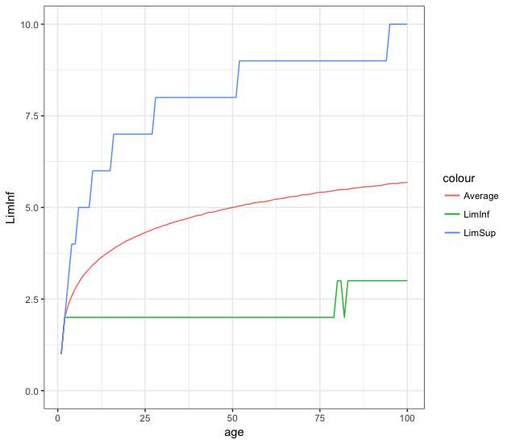

# Birthday-Candles

## Problem Statement

It’s your 30th birthday (congrats, by the way), and your friends bought you a cake with 30 candles on it. You make a wish and try to blow them out. Every time you blow, you blow out a random number of candles between one and the number that remain, including one and that other number. How many times do you blow before all the candles are extinguished, on average?

## Solution

The average number of times you need to blow the candles is . You can find my monte carlo simulation at https://github.com/mnunes/Birthday-Candles/blob/master/birthdayCandles.R . The code run for all ages between 1 and 100, 50,000 times each. It took 2495.047 seconds (0.693068611 hours) to run completely.

